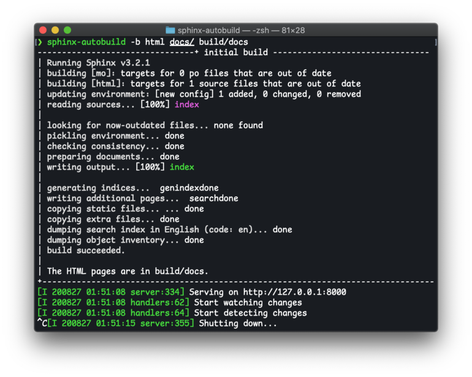

================
sphinx-autobuild
================

Rebuild Sphinx documentation on changes, with live-reload in the browser.

Installation
============

sphinx-autobuild is available on `PyPI <https://pypi.org/project/sphinx-autobuild/>`__.
It can be installed using pip:

.. code-block:: bash

   pip install sphinx-autobuild

Usage
=====

To build a classical Sphinx documentation set, run:

.. code-block:: bash

   sphinx-autobuild docs docs/_build/html

This will start a server at http://127.0.0.1:8000
and start watching for changes in the ``docs/`` directory.
When a change is detected in ``docs/``, the documentation is rebuilt
and any open browser windows are reloaded automatically.
``KeyboardInterrupt`` (``ctrl`` + ``c``) will stop the server.

Command line options
====================

sphinx-autobuild accepts the same arguments as ``sphinx-build``
(these get passed to sphinx-build on each build).
It also has a few additional options,
which can seen by running ``sphinx-autobuild --help``:

.. code-block:: console

   $ sphinx-autobuild --help
   usage: sphinx-autobuild [-h] [--port PORT] [--host HOST] [--re-ignore RE_IGNORE] [--ignore IGNORE] [--no-initial] [--open-browser]
                           [--delay DELAY] [--watch DIR] [--pre-build COMMAND] [--version]
                           sourcedir outdir [filenames [filenames ...]]

   positional arguments:
     sourcedir             source directory
     outdir                output directory for built documentation
     filenames             specific files to rebuild on each run (default: None)

   optional arguments:
     -h, --help            show this help message and exit
     --port PORT           port to serve documentation on. 0 means find and use a free port (default: 8000)
     --host HOST           hostname to serve documentation on (default: 127.0.0.1)
     --re-ignore RE_IGNORE
                           regular expression for files to ignore, when watching for changes (default: [])
     --ignore IGNORE       glob expression for files to ignore, when watching for changes (default: [])
     --no-initial          skip the initial build (default: False)
     --open-browser        open the browser after building documentation (default: False)
     --delay DELAY         how long to wait before opening the browser (default: 5)
     --watch DIR           additional directories to watch (default: [])
     --pre-build COMMAND   additional command(s) to run prior to building the documentation (default: [])
     --version             show program's version number and exit

   sphinx's arguments:
     The following arguments are forwarded as-is to Sphinx. Please look at `sphinx --help` for more information.
       -b=builder, -a, -E, -d=path, -j=N, -c=path, -C, -D=setting=value, -t=tag, -A=name=value, -n, -v, -q, -Q, -w=file, -W, -T, -N, -P, --keep-going, --color

Using with Makefile
-------------------

    FYI: Sphinx is planning to `move away from`_ using `Makefile`.

To use sphinx-autobuild with the Makefile generated by Sphinx,
add the following to the end of the Makefile:

.. code-block:: make

   livehtml:
      sphinx-autobuild "$(SOURCEDIR)" "$(BUILDDIR)" $(SPHINXOPTS) $(O)

``make livehtml`` will now invoke sphinx-autobuild.

    If you generated the `Makefile` with an older version of sphinx,
    this syntax might not work for you.
    Consider `updating to the newer structure`_.

.. _move away from: https://github.com/sphinx-doc/sphinx/issues/5618#issuecomment-502415633
.. _updating to the newer structure: https://github.com/sphinx-doc/sphinx/blob/v3.0.0/sphinx/templates/quickstart/Makefile.new_t

Automatically opening the browser
---------------------------------

sphinx-autobuild can open the homepage of the generated documentation
in your default browser.
Passing ``--open-browser`` will enable this behaviour.

Automatically selecting a port
------------------------------

sphinx-autobuild asks the operating system for a free port number
and use that for its server.
Passing ``--port=0`` will enable this behaviour.

Workflow suggestions
====================

Working on a Sphinx HTML theme
------------------------------

When working on a Sphinx HTML theme,
add the source directory of the theme as a watch directory.
It is also recommended to disable Sphinx's incremental builds
by passing the ``-a`` option to sphinx-autobuild.

.. code-block:: bash

   sphinx-autobuild -a docs docs/_build/html --watch path/to/theme

This results in slower builds, but it ensures that
all pages are built from the same state of the HTML theme.
It also works around a `known issue in Sphinx <relevant sphinx bugs_>`__
which causes significant problems during theme development.

Working on multiple projects
----------------------------

When working on multiple Sphinx documentation projects simultaneously,
it is required to use different output directories for each project.
It is also recommended to use ``--port=0`` and ``--open-browser``
to avoid needing to manually manage ports and opening browser windows
(which can get tedious quickly).

.. code-block:: bash

   sphinx-autobuild --port=0 --open-browser pikachu/docs pikachu/docs/_build/html &
   sphinx-autobuild --port=0 --open-browser magikarp/docs magickarp/docs/_build/html &

Relevant Sphinx Bugs
====================

Sphinx does not `detect changes in non-document, non-code files in incremental mode`__,
like theme files and static files.

At the time of writing, the only known workaround is
to instruct Sphinx to rebuild the relevant pages.
This can be done by disabling incremental mode (with ``-a``)
or passing relevant ``filenames`` in addition to source and output directory in the CLI.

__ https://github.com/GaretJax/sphinx-autobuild/issues/34

Acknowledgements
================

This project stands on the shoulders of giants like
Sphinx_, LiveReload_ and python-livereload_,
without whom this project would not be possible.

Many thanks to everyone who has `contributed code`_ as well as
participated in `discussions on the issue tracker`_.
This project is better thanks to your contribution.

.. _Sphinx: https://sphinx-doc.org/
.. _LiveReload: https://livereload.com/
.. _python-livereload: https://github.com/lepture/python-livereload
.. _contributed code: https://github.com/GaretJax/sphinx-autobuild/graphs/contributors
.. _discussions on the issue tracker: https://github.com/GaretJax/sphinx-autobuild/issues
